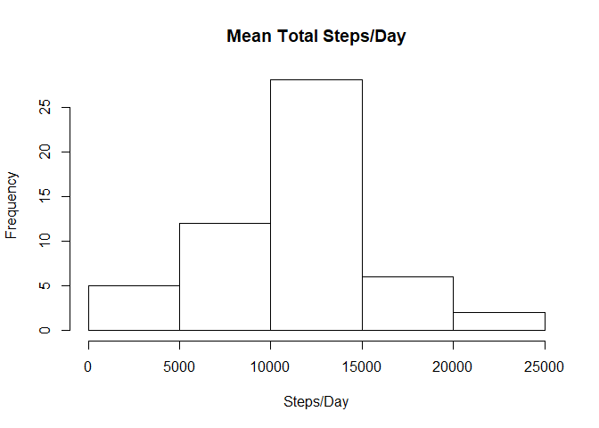
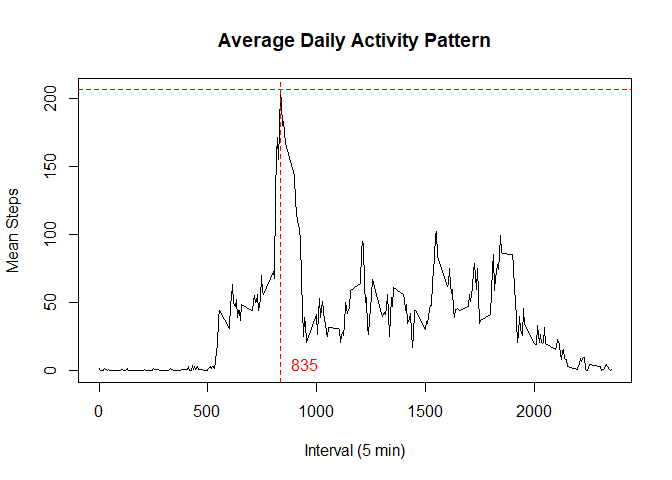
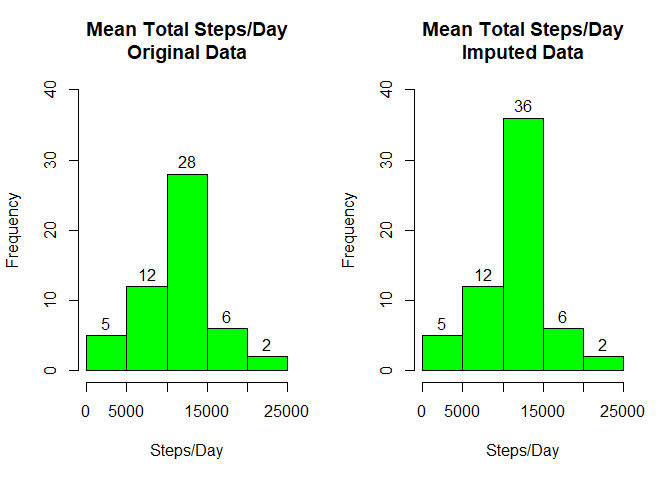
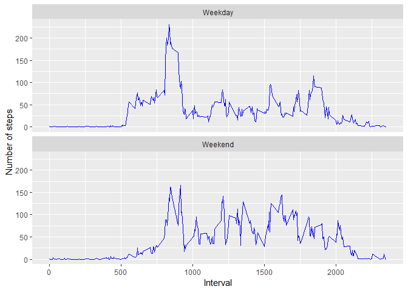

## Loading and preprocessing the data

```r
library(dplyr)
```

```
## 
## Attaching package: 'dplyr'
```

```
## The following objects are masked from 'package:stats':
## 
##     filter, lag
```

```
## The following objects are masked from 'package:base':
## 
##     intersect, setdiff, setequal, union
```

```r
library(lubridate)
```

```
## 
## Attaching package: 'lubridate'
```

```
## The following object is masked from 'package:base':
## 
##     date
```

```r
library(ggplot2)

dat <- read.csv("C:/Users/tomyr95/Documents/activity.csv")
```

## What is mean total number of steps taken per day?

```r
StepsPerDay <- dat %>% filter(!is.na(steps)) %>% group_by(date) %>% summarize(total=sum(steps))

hist(StepsPerDay$total, main = "Mean Total Steps/Day", xlab = "Steps/Day")
```



```r
summary(StepsPerDay$total)
```

```
##    Min. 1st Qu.  Median    Mean 3rd Qu.    Max. 
##      41    8841   10765   10766   13294   21194
```

## What is the average daily activity pattern?

```r
StepsPerInterval <- dat %>% filter(!is.na(steps)) %>% group_by(interval) %>%
                            summarize(MeanSteps=round(mean(steps)))

with(StepsPerInterval, plot(interval, MeanSteps, type="l",
                            main = "Average Daily Activity Pattern",
                            xlab = "Interval (5 min)",
                            ylab = "Mean Steps"))

MaxMean <- max(StepsPerInterval$MeanSteps)
MaxInterval <- StepsPerInterval[which(StepsPerInterval$MeanSteps == MaxMean), 1]

abline(h = MaxMean, col="red", lty = 2)
abline(v = MaxInterval, col = "red", lty = 2)
text(950, 5, MaxInterval, col = "red")
```



```r
summary(dat$steps)
```

```
##    Min. 1st Qu.  Median    Mean 3rd Qu.    Max.    NA's 
##    0.00    0.00    0.00   37.38   12.00  806.00    2304
```

## Imputing missing values
* Devise strategy for filling in missing values: Use the mean for coresponding invteral containing Non-NA.
* Create new dataset with the missing data filled in.

```r
dat2 <- dat
for(i in 1:length(dat2$interval))
{
      if(is.na(dat2$steps[i])){dat2$steps[i] <- as.integer(StepsPerInterval[StepsPerInterval$interval
            == dat2$interval[i], 2])}
}

StepsPerDay <- dat %>% filter(!is.na(steps)) %>% group_by(date) %>% summarize(total=sum(steps))
StepsPerDay2 <- dat2 %>% group_by(date) %>% summarize(total=sum(steps))

par(mfrow = c(1,2))

hist(StepsPerDay$total, main="Mean Total Steps/Day\nOriginal Data", xlab="Steps/Day", 
     col = "green", labels = TRUE, ylim = c(0, 40))

hist(StepsPerDay2$total, main="Mean Total Steps/Day\nImputed Data", xlab="Steps/Day", 
     col = "green", labels = TRUE, ylim = c(0, 40))
```



```r
summary(StepsPerDay$total)
```

```
##    Min. 1st Qu.  Median    Mean 3rd Qu.    Max. 
##      41    8841   10765   10766   13294   21194
```

```r
summary(StepsPerDay2$total)
```

```
##    Min. 1st Qu.  Median    Mean 3rd Qu.    Max. 
##      41    9819   10762   10766   12811   21194
```

## Are there differences in activity patterns between weekdays and weekends?

```r
dat3 <- dat2 %>% mutate(DayType = weekdays(ymd(date)))

WkEnd <- c("Saturday", "Sunday")
WkDay <- c("Monday", "Tuesday", "Wednesday", "Thursday", "Friday")

for(i in 1:length(dat3$DayType))
{
      if(dat3$DayType[i] %in% WkEnd) {dat3$DayType[i] <- "Weekend"}
      if(dat3$DayType[i] %in% WkDay) {dat3$DayType[i] <- "Weekday"}
}
dat4 <- dat3 %>% group_by(DayType, interval) %>% summarize(MeanSteps=mean(steps))

g <- ggplot(dat4, aes(interval, MeanSteps))

g + facet_wrap(DayType ~ ., ncol = 1) + geom_line(color = "blue") + xlab("Interval") + ylab("Number of steps")
```


